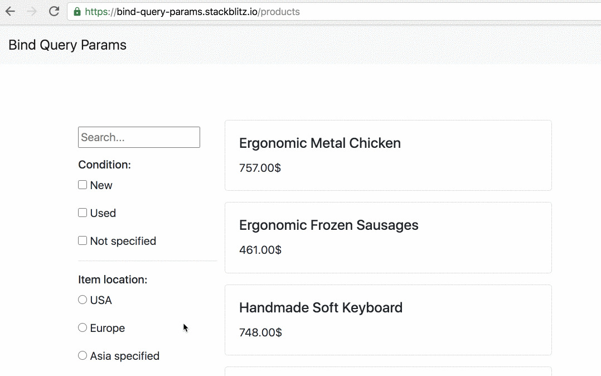

<p align="center">
 
</p>

<br />

[]()
[]()
[]()
[](https://github.com/prettier/prettier)
[](#contributors-)
[](https://github.com/ngneat/)
[]()


> Sync URL Query Params with Angular Form Controls

The library provides a simple and reusable solution for binding URL query params to Angular Forms

## Demo



## Installation

`npm install @ngneat/bind-query-params`

## Usage

Inject the `BindQueryParamsFactory` provider, pass an array of [definitions](#QueryParamDefinition) and `connect` it to your form:

<!-- prettier-ignore -->
```ts
import { BindQueryParamsFactory } from '@ngneat/bind-query-params';

interface Filters {
  searchTerm: string;
  someBoolean: boolean;
}

@Component({
  template: `Your normal form setup`,
})
export class MyComponent {
  filters = new FormGroup({
    searchTerm: new FormControl(),
    someBoolean: new FormControl(false),
  });

  bindQueryParamsManager = this.factory
    .create<Filters>([
      { queryKey: 'searchTerm' },
      { queryKey: 'someBoolean', type: 'boolean' }
     ]).connect(this.filters);

  constructor(private factory: BindQueryParamsFactory) {}

  ngOnDestroy() {
    this.bindQueryParamsManager.destroy();
  }
}
```

With this setup, the `manager` will take care of two things:

1. Update the `control`'s value when the page is loaded for the first time
2. Update the URL query parameter when the corresponding `control` value changes

## QueryParam Definition

### `queryKey`

The query parameter key

### `path`

The form control path. If it is not specified, the manager assumes that the `path` is the `queryKey`. We can also pass nested keys, for example, `person.name`:

```ts
{ queryKey: 'name', path: 'person.name' }
```

### `type`

Specify the control value type. Available options are:
`string`, `boolean`, `array`.
Before updating the control with the value, the manager will parse it based on the provided `type`.

### `parser`

Provide a custom parser. For example, the default `array` parser converts the value to an `array` of strings. If we need it to be an array of numbers, we can pass the following `parser`:

```ts
const def = { parser: (value) => value.split(',').map((v) => +v) };
```

### `serializer`

Provide a custom serializer. For example, supposing that we have a `FormControl` that carries a Date and we want to persist, in the query params, a custom value, such as a `string` Date, we can do something like the following `serializer`:

```ts
const def = { serializer: (value) => (value instanceof Date ? value.toISOString().slice(0, 10) : (value as string)) };
```

### `strategy`

When working with async control values, for example, a dropdown list that its options come from the server, we cannot immediately update the control.

In this cases, we can provide the `modelToUrl` strategy, that will not update the control value when the page loads. When the data is available we can call the `manager.syncDefs()` method that'll update the controls based on the current query params:

```ts
@Component()
export class MyComponent {
  filters = new FormGroup({
    searchTerm: new FormControl(),
    users: new FormControl([]),
    someBoolean: new FormControl(false),
  });

  bindQueryParamsManager = this.factory
    .create<Filters>([
      { queryKey: 'searchTerm' },
      { queryKey: 'someBoolean', type: 'boolean' },
      { queryKey: 'users', type: 'array', strategy: 'modelToUrl' },
    ])
    .connect(this.filters);

  constructor(private factory: BindQueryParamsFactory) {}

  ngOnInit() {
    service.getUsers().subscribe((users) => {
      // Initalize the dropdown
      this.users = users;
      this.manager.syncDefs('users');
    });
  }

  ngOnDestroy() {
    this.bindQueryParamsManager.destroy();
  }
}
```

Note that `syncDefs` will always be called once under the hood.

## Browser Support

The library uses the [URLSearchParams](https://developer.mozilla.org/en-US/docs/Web/API/URLSearchParams) API, which supported in any browser except IE.

## Contributors ✨

Thanks goes to these wonderful people ([emoji key](https://allcontributors.org/docs/en/emoji-key)):

<!-- ALL-CONTRIBUTORS-LIST:START - Do not remove or modify this section -->
<!-- prettier-ignore-start -->
<!-- markdownlint-disable -->
<table>
  <tr>
    <td align="center"><a href="https://www.netbasal.com/"><br /><sub><b>Netanel Basal</b></sub></a><br /><a href="https://github.com/@ngneat/bind-query-params/commits?author=NetanelBasal" title="Code">💻</a> <a href="#content-NetanelBasal" title="Content">🖋</a> <a href="https://github.com/@ngneat/bind-query-params/commits?author=NetanelBasal" title="Documentation">📖</a> <a href="#ideas-NetanelBasal" title="Ideas, Planning, & Feedback">🤔</a> <a href="#infra-NetanelBasal" title="Infrastructure (Hosting, Build-Tools, etc)">🚇</a></td>
  </tr>
</table>

<!-- markdownlint-restore -->
<!-- prettier-ignore-end -->

<!-- ALL-CONTRIBUTORS-LIST:END -->

This project follows the [all-contributors](https://github.com/all-contributors/all-contributors) specification. Contributions of any kind welcome!

<div>Icons made by <a href="http://www.freepik.com/" title="Freepik">Freepik</a> from <a href="https://www.flaticon.com/" title="Flaticon">www.flaticon.com</a></div>
